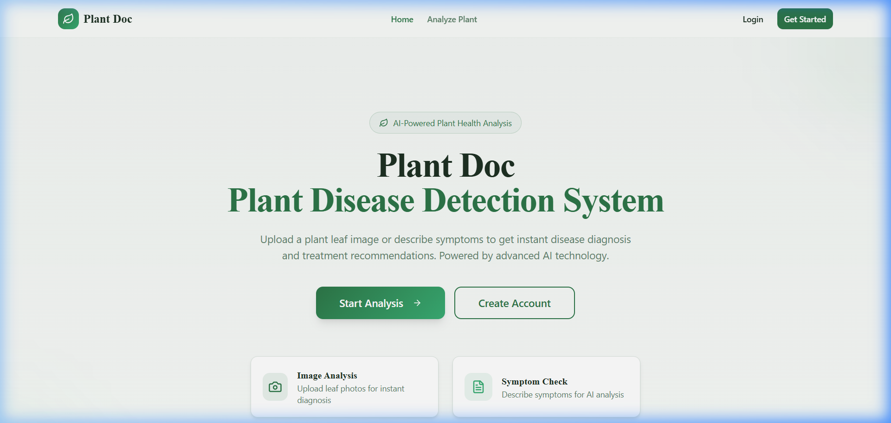
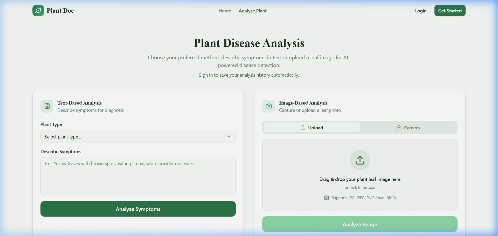

# 🌱 PlantDoc - Multimodal Plant Disease Detection

PlantDoc is a multimodal plant disease detection system that combines computer vision and NLP models to diagnose crop diseases from leaf images and symptom descriptions. It supports image-only, text-only, and fused predictions with calibrated confidence for reliable agricultural decision support.



## 🚀 Features

- **Multimodal Diagnostics**:
  - **Visual Analysis**: Upload photos of plant leaves for instant AI detection.
  - **Symptom-Based Analysis**: Describe plant symptoms in text for a detailed health report.
  - **Fused Predictions**: Combines visual and textual data for higher accuracy.
- **Modern UI/UX**: Built with a clean, responsive interface using Tailwind CSS and Radix UI.
- **Real-time Processing**: Fast inference and feedback for quick decision-making in the field.
- **Secure Backend**: Powered by Supabase for reliable data management and authentication.

## 🛠️ Tech Stack

- **Frontend**: React.js with TypeScript
- **Build Tool**: Vite
- **Styling**: Tailwind CSS & shadcn/ui
- **Icons**: Lucide React
- **Backend & Auth**: Supabase
- **State Management**: TanStack Query (React Query)

## 🏁 Getting Started

### Prerequisites

- Node.js (v18 or higher)
- npm or bun

### Installation

1. **Clone the repository**:
   ```sh
   git clone https://github.com/akashpateldev/PlantDoc.git
   cd PlantDoc
   ```

2. **Install dependencies**:
   ```sh
   npm install
   ```

3. **Environment Setup**:
   Create a `.env` file in the root directory and add your Supabase credentials (see `.env.example` if available):
   ```env
   VITE_SUPABASE_URL=your_supabase_url
   VITE_SUPABASE_PUBLISHABLE_KEY=your_supabase_key
   ```

4. **Run the development server**:
   ```sh
   npm run dev
   ```

## 📸 Screenshots

### Main Dashboard


### Analysis Tools



## 📄 License

Distributed under the MIT License. See `LICENSE` for more information.

---
Built with ❤️ for a greener planet.
